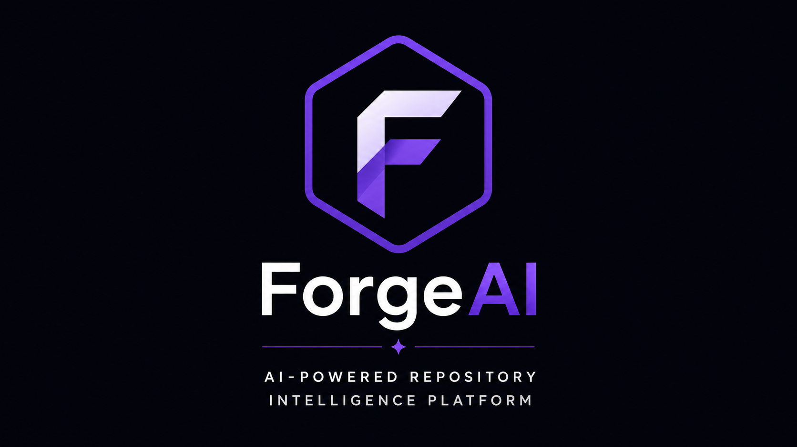
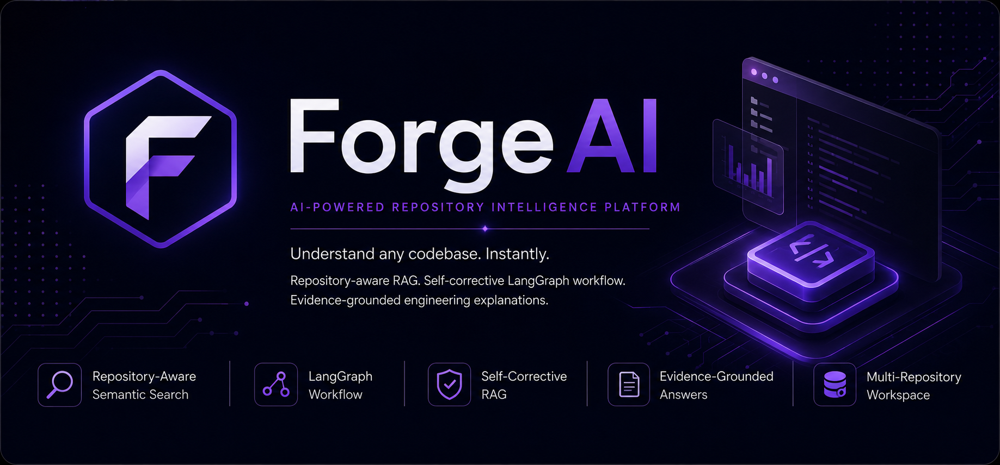
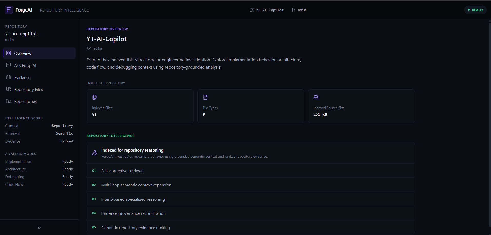
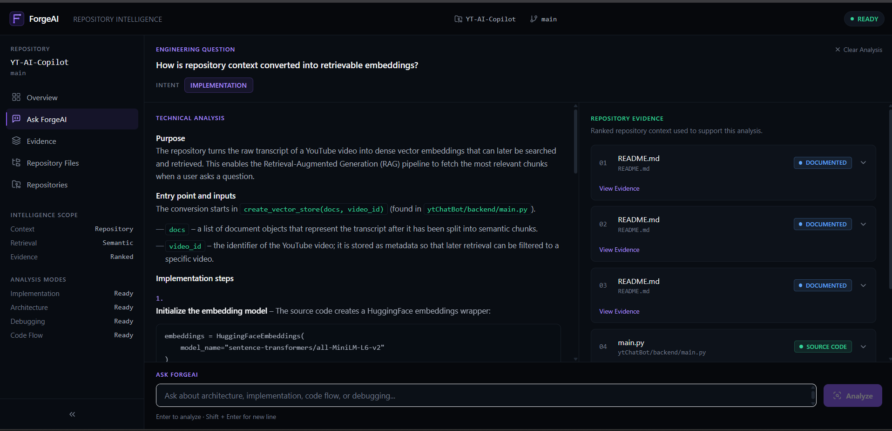
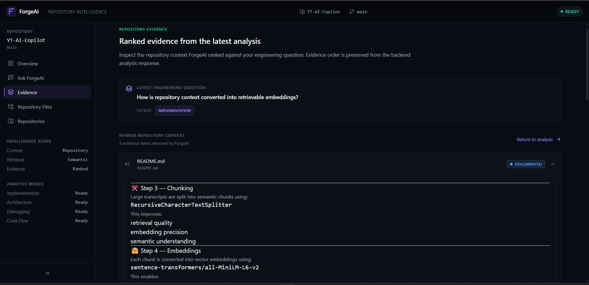
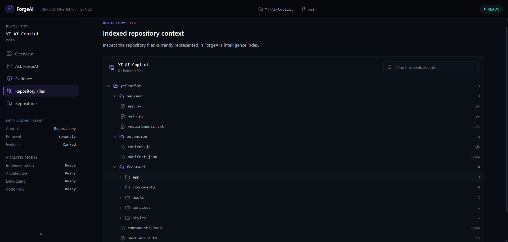
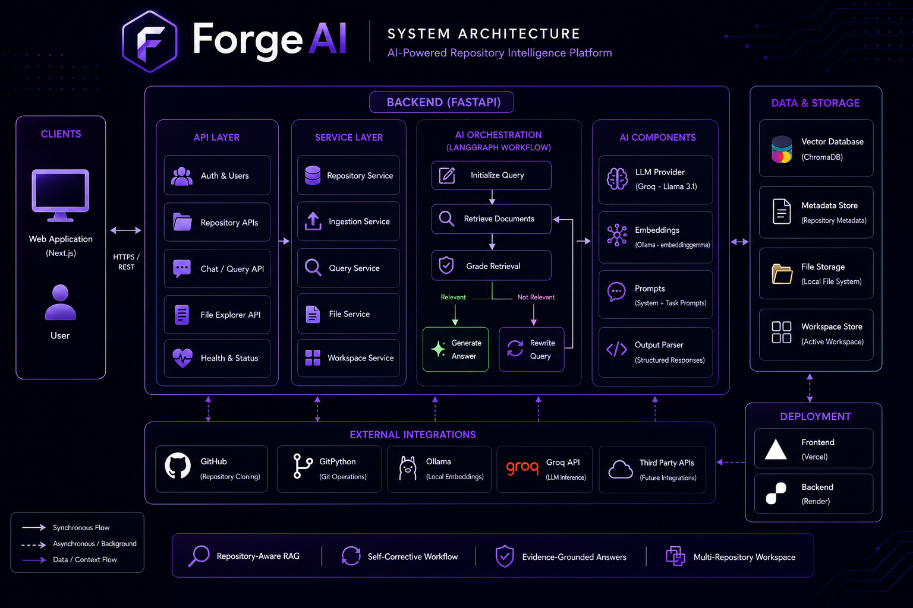
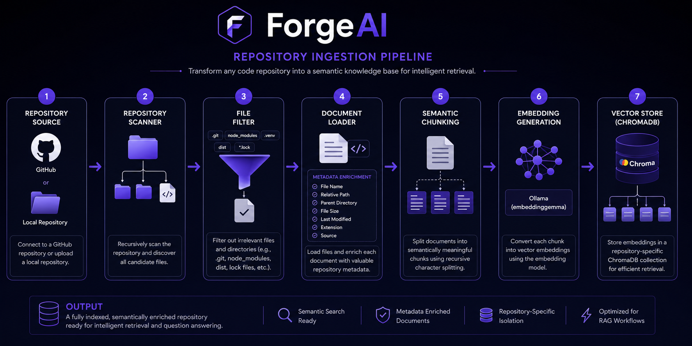
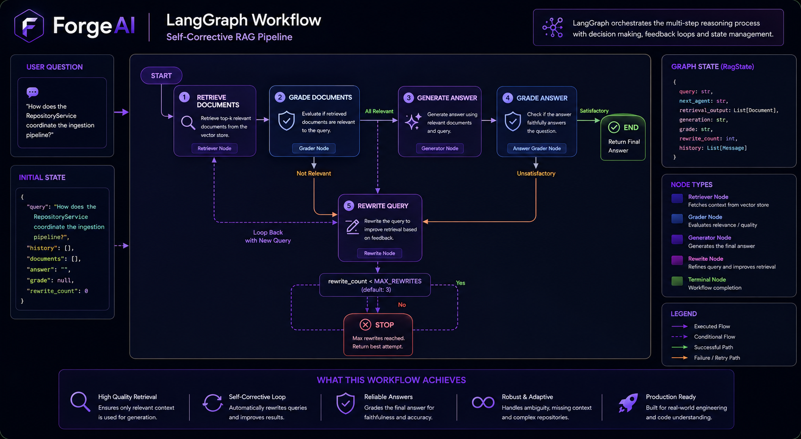

<p align="center">



# ForgeAI

### AI-Powered Repository Intelligence Platform

**Understand software repositories through Retrieval-Augmented Generation, repository-aware semantic search, and LangGraph-powered self-corrective workflows.**

<p>


</p>

</p>

---

ForgeAI is an AI-powered repository intelligence platform that helps developers understand unfamiliar software repositories through repository-grounded Retrieval-Augmented Generation (RAG).

Instead of behaving like a generic code chatbot, ForgeAI transforms an entire repository into a semantic knowledge base, retrieves implementation-aware context, evaluates retrieval quality, automatically rewrites weak retrieval queries, and generates evidence-grounded engineering explanations using a LangGraph-orchestrated workflow.

<p align="center">



</p>

---

# 🎥 Demo

<p align="center">


</p>

### Repository Intelligence Workflow

```text
GitHub Repository
        │
        ▼
Repository Ingestion
        │
        ▼
Semantic Repository Index
        │
        ▼
Ask Engineering Question
        │
        ▼
LangGraph Self-Corrective Workflow
        │
        ▼
Evidence-Grounded Technical Answer
```

---

# 🚀 Why ForgeAI?

Understanding an unfamiliar software repository is one of the most time-consuming parts of software engineering.

Developers often spend hours exploring folders, tracing function calls, and connecting implementation details spread across multiple files before understanding how a feature actually works.

Traditional Retrieval-Augmented Generation systems retrieve semantically similar chunks and immediately generate responses.

Software repositories introduce additional challenges:

- implementation logic spans multiple files
- architectural context is often more important than individual snippets
- weak retrieval results produce misleading explanations
- repository structure influences engineering reasoning
- semantic similarity alone cannot capture implementation flow

ForgeAI addresses these challenges through a repository-centric AI workflow that combines:

- structured repository ingestion
- semantic vector indexing
- repository-aware retrieval
- retrieval quality evaluation
- automatic query rewriting
- evidence-grounded answer generation

The objective is not to build another chatbot.

The objective is to help developers understand software systems.

---

# ✨ Features

## 📂 Repository Intelligence

- GitHub Repository Indexing
- Local Repository Upload
- Multi-Repository Workspace
- Repository-aware Semantic Search
- Repository File Explorer
- Repository Metadata Preservation

---

## 🧠 AI Workflow

- LangGraph-based Self-Corrective RAG
- Retrieval Grading
- Automatic Query Rewriting
- Repository Evidence Inspection
- Grounded Engineering Explanations
- Multi-hop Semantic Context Expansion

---

## ⚙️ Backend Engineering

- Modular Repository Ingestion Pipeline
- ChromaDB Vector Collections
- Explicit Workflow State
- Deterministic Graph Routing
- Repository Isolation
- Production-inspired Backend Architecture

---

# 📸 Screenshots

## Repository Workspace

<p align="center">



</p>

Switch between multiple indexed repositories without rebuilding semantic indexes.

---

## Ask ForgeAI

<p align="center">



</p>

Ask repository-level engineering questions grounded in indexed source code.

---

## Evidence Panel

<p align="center">



</p>

Inspect retrieved repository evidence used to generate the final response.

---

## Repository Explorer

<p align="center">



</p>

Browse every indexed repository file represented inside the vector database.

---

# ⭐ What Makes ForgeAI Different?

Most repository assistants follow a simple workflow:

```text
Question
    ↓
Retrieve
    ↓
Generate Answer
```

ForgeAI introduces an additional reasoning layer.

```text
Question
    ↓
Retrieve Repository Context
    ↓
Evaluate Retrieval Quality
    ↓
Rewrite Retrieval Query
    ↓
Retrieve Again
    ↓
Generate Grounded Answer
```

Instead of assuming the first retrieval is sufficient, ForgeAI attempts to improve weak retrieval before generating the final response.

This produces answers that are better grounded in repository implementation rather than relying solely on semantic similarity.

# 🏗️ System Architecture

ForgeAI follows a layered architecture that separates repository ingestion, vector indexing, AI orchestration, and API services into independent modules.

Each layer owns a single responsibility, making the system modular, maintainable, and easy to extend.

<p align="center">



</p>

---

## High-Level Request Lifecycle

```text
                    User
                      │
                      ▼
               Next.js Frontend
                      │
                      ▼
                FastAPI Backend
                      │
        ┌─────────────┴─────────────┐
        │                           │
        ▼                           ▼
Repository Management          Query Service
        │                           │
        ▼                           ▼
Repository Ingestion         LangGraph Workflow
        │                           │
        ▼                           ▼
     ChromaDB              Repository Retrieval
        │                           │
        └─────────────┬─────────────┘
                      ▼
             Grounded Engineering Answer
```

The frontend is intentionally lightweight.

Most of the system intelligence lives inside the backend through repository ingestion, semantic retrieval, workflow orchestration, and grounded answer generation.

---

# 📂 Repository Ingestion Pipeline

Before a repository becomes searchable, ForgeAI converts it into a structured semantic knowledge base.

<p align="center">



</p>

The ingestion pipeline consists of multiple independent stages.

```text
GitHub Repository / Local Repository
                │
                ▼
        Repository Scanner
                │
                ▼
      Repository File Filter
                │
                ▼
         Document Loader
                │
                ▼
       Metadata Enrichment
                │
                ▼
 Recursive Character Chunking
                │
                ▼
      Embedding Generation
                │
                ▼
 Repository-specific Chroma Collection
```

Each stage focuses on one responsibility before passing data to the next stage.

This modular architecture allows every component to evolve independently.

---

## Repository Scanner

The scanner recursively traverses the repository and discovers every candidate source file.

Responsibilities:

- recursive directory traversal
- repository discovery
- file enumeration

The scanner intentionally avoids reading file contents.

Its only responsibility is discovering files.

---

## Repository File Filter

Not every repository file is useful for semantic retrieval.

ForgeAI filters directories and generated files such as:

- `.git`
- `node_modules`
- virtual environments
- compiled artifacts
- lock files
- unsupported extensions

Filtering reduces vector database noise while improving retrieval quality.

---

## Document Loader

Each supported source file is converted into a LangChain `Document`.

Besides file content, ForgeAI preserves repository metadata.

### Preserved Metadata

```text
file_name

relative_path

parent_directory

extension

file_size

last_modified

source
```

Repository metadata enables:

- repository exploration
- evidence tracing
- source attribution
- repository reconstruction
- grounded explanations

---

## Semantic Chunking

Large source files exceed LLM context windows.

ForgeAI uses recursive character chunking to divide source files into semantically meaningful chunks before embedding.

Chunking improves:

- retrieval precision
- embedding quality
- context relevance
- retrieval efficiency

---

## Embedding Generation

Every chunk is transformed into a vector representation using an embedding model.

These embeddings capture semantic meaning rather than lexical similarity.

ForgeAI currently supports local embedding generation through Ollama while remaining provider-agnostic.

---

## Repository-specific Vector Storage

Each indexed repository receives its own independent ChromaDB collection.

```text
YT-AI-Copilot
        │
        ▼
Collection A

--------------------------

ForgeAI
        │
        ▼
Collection B

--------------------------

Simon Game
        │
        ▼
Collection C
```

Repository isolation provides several advantages:

- workspace switching
- independent repository indexes
- simpler retrieval
- cleaner lifecycle management
- no cross-repository contamination

---

# 🧠 Self-Corrective RAG Workflow

Traditional Retrieval-Augmented Generation follows a straightforward pipeline.

```text
Question
      │
      ▼
Retrieve
      │
      ▼
Generate Answer
```

ForgeAI introduces an intermediate reasoning stage.

Instead of assuming retrieved context is sufficient, the workflow evaluates retrieval quality before answer generation.

<p align="center">



</p>

```text
Question
      │
      ▼
Retrieve Repository Context
      │
      ▼
Evaluate Retrieval
      │
      ├──────── Relevant ───────► Generate Answer
      │
      ▼
Rewrite Retrieval Query
      │
      ▼
Retrieve Again
```

This iterative workflow reduces weak retrieval while improving repository grounding.

---

# 🔄 LangGraph Workflow

ForgeAI uses LangGraph to orchestrate workflow execution.

Each node performs one clearly defined task.

```text
START
   │
   ▼
Initialize Query
   │
   ▼
Retrieve Documents
   │
   ▼
Grade Retrieval
   │
   ├────────► Generate Answer
   │
   ▼
Rewrite Query
   │
   ▼
Retrieve Documents
```

Rather than embedding workflow logic inside prompts, execution is controlled explicitly through graph edges and routing functions.

---

# 🧠 Workflow State

LangGraph maintains a shared state throughout graph execution.

The state contains information such as:

- active repository
- original question
- retrieval query
- retrieved documents
- retrieval grade
- retry counter
- generated answer

Each node:

- reads only the state it requires
- performs one operation
- writes its result back into the shared state

Explicit state management makes workflow execution:

- observable
- deterministic
- extensible
- easier to debug

---

# 🔍 Repository Retrieval Pipeline

Repository retrieval is more than vector search.

The retrieval workflow consists of multiple stages.

```text
User Question
        │
        ▼
Semantic Retrieval
        │
        ▼
Cross-file Context Expansion
        │
        ▼
Retrieval Evaluation
        │
        ▼
Evidence Ranking
        │
        ▼
Grounded Answer Generation
```

Instead of relying on a single retrieval step, ForgeAI progressively refines repository context before generation.

---

# 📂 Multi-Repository Workspace

ForgeAI supports multiple indexed repositories simultaneously.

Each repository maintains:

- independent vector collection
- isolated retrieval context
- separate semantic index
- dedicated workspace

Switching repositories does not require rebuilding embeddings or restarting the application.

The active repository determines which semantic collection participates in retrieval.

---

# ⭐ Engineering Design Principles

ForgeAI emphasizes production-inspired backend architecture.

---

## Separation of Concerns

Every subsystem owns one clearly defined responsibility.

```text
Repository Scanner

↓

Repository Filter

↓

Document Loader

↓

Chunking

↓

Embedding Generation

↓

Vector Store

↓

Retriever

↓

LangGraph

↓

LLM
```

No component performs multiple unrelated tasks.

---

## Explicit Workflow State

Workflow execution is driven through explicit graph state instead of hidden prompt variables.

This makes execution transparent and easier to debug.

---

## Deterministic Routing

LLMs produce reasoning signals.

Python routing functions determine workflow transitions.

Separating reasoning from execution makes workflow behavior predictable.

---

## Repository Isolation

Each repository receives an independent semantic index.

This enables:

- cleaner retrieval
- safer indexing
- independent lifecycle management
- multi-repository workspaces

---

## Bounded Agentic Execution

ForgeAI limits query rewrite attempts through a retry counter.

This prevents:

- infinite graph execution
- unnecessary LLM calls
- uncontrolled latency
- unpredictable execution cost

Every workflow is guaranteed to terminate.

# 🛠️ Technology Stack

ForgeAI combines modern AI engineering tools with a modular backend architecture.

| Layer | Technologies |
|--------|--------------|
| **Frontend** | Next.js, React, Tailwind CSS |
| **Backend** | FastAPI, Python |
| **AI Framework** | LangChain, LangGraph |
| **LLM Provider** | Groq (Llama 3.1), Configurable LLM Provider |
| **Embeddings** | Ollama (embeddinggemma) |
| **Vector Database** | ChromaDB |
| **Repository Integration** | GitPython |
| **Validation** | Pydantic |
| **Deployment** | Vercel, Render |
| **Version Control** | Git, GitHub |

---

# 📁 Project Structure

```text
ForgeAI
│
├── backend
│   ├── app
│   │   ├── ai
│   │   │   ├── graph
│   │   │   ├── ingestion
│   │   │   ├── llm
│   │   │   ├── prompts
│   │   │   ├── retrieval
│   │   │   └── vectorstore
│   │   │
│   │   ├── api
│   │   ├── config
│   │   ├── integrations
│   │   ├── services
│   │   ├── schemas
│   │   └── core
│   │
│   ├── tests
│   └── requirements.txt
│
├── frontend
│   ├── app
│   ├── components
│   ├── context
│   ├── hooks
│   ├── services
│   ├── utils
│   └── public
│
├── docs
├── screenshots
├── README.md
└── LICENSE
```

---

# ⚡ Getting Started

## 1. Clone the Repository

```bash
git clone https://github.com/Shlokm13/ForgeAI.git

cd ForgeAI
```

---

## 2. Backend Setup

Create a virtual environment.

```bash
cd backend

python -m venv venv
```

Activate it.

### Windows

```bash
venv\Scripts\activate
```

### Linux / macOS

```bash
source venv/bin/activate
```

Install dependencies.

```bash
pip install -r requirements.txt
```

---

## 3. Configure Environment Variables

Create a `.env` file inside the backend directory.

```env
GROQ_API_KEY=YOUR_API_KEY

OLLAMA_BASE_URL=http://localhost:11434
```

---

## 4. Start Ollama

Pull the embedding model.

```bash
ollama pull embeddinggemma
```

Run Ollama.

```bash
ollama serve
```

---

## 5. Start the Backend

```bash
uvicorn app.main:app --reload
```

Backend runs on

```text
http://localhost:8000
```

---

## 6. Frontend Setup

```bash
cd frontend

npm install

npm run dev
```

Frontend runs on

```text
http://localhost:3000
```

---

# 📡 API Overview

ForgeAI exposes a REST API for repository indexing and repository-aware question answering.

| Endpoint | Description |
|-----------|-------------|
| `POST /repository/upload/local` | Index a local repository |
| `POST /repository/upload/github` | Clone and index a GitHub repository |
| `GET /repository/list` | List indexed repositories |
| `GET /repository/files/{repository}` | Inspect indexed repository files |
| `POST /chat` | Ask repository-aware engineering questions |

---

# 💬 Example Questions

Once a repository has been indexed, ForgeAI can answer questions such as:

### Repository Architecture

```text
Explain the architecture of this repository.
```

```text
How are services organized?
```

```text
What design pattern is used here?
```

---

### Implementation

```text
How does RepositoryService coordinate ingestion?
```

```text
Explain the upload pipeline.
```

```text
How are embeddings generated?
```

```text
How does repository switching work?
```

---

### AI Pipeline

```text
How does LangGraph orchestrate execution?
```

```text
Explain query rewriting.
```

```text
How are retrieved documents graded?
```

```text
Where does the final answer come from?
```

---

### Code Understanding

```text
Where is authentication implemented?
```

```text
Which files manage repository uploads?
```

```text
How is semantic retrieval implemented?
```

```text
Where is ChromaDB initialized?
```

---

# 🚀 Future Roadmap

## Repository Intelligence

- [ ] Incremental repository indexing
- [ ] Repository update detection
- [ ] Symbol-aware retrieval
- [ ] AST-assisted repository understanding
- [ ] Call graph analysis

---

## AI Workflow

- [ ] Hybrid retrieval
- [ ] Context compression
- [ ] Streaming LangGraph execution
- [ ] Retrieval evaluation dashboard
- [ ] Answer confidence estimation

---

## Developer Experience

- [ ] Docker support
- [ ] CI/CD pipeline
- [ ] Repository benchmarking
- [ ] One-click deployment
- [ ] Multi-user workspaces

---

# 🤝 Contributing

Contributions are welcome.

If you'd like to improve ForgeAI:

1. Fork the repository.
2. Create a feature branch.
3. Commit your changes.
4. Submit a pull request.

Please keep changes modular and aligned with the existing architecture.

---

# 📄 License

This project is licensed under the MIT License.

See the `LICENSE` file for details.

---

# 🙌 Acknowledgements

ForgeAI builds upon several outstanding open-source projects.

Special thanks to:

- LangChain
- LangGraph
- FastAPI
- ChromaDB
- Ollama
- Groq
- Next.js

for making modern AI engineering accessible.

---

# 👨‍💻 Author

## Shlok Nitesh Mishra

B.Tech Information Technology  
International Institute of Information Technology, Bhubaneswar

- GitHub: https://github.com/Shlokm13
- LinkedIn: https://linkedin.com/in/shlok-mishra13

---

<p align="center">

⭐ If you found ForgeAI interesting, consider starring the repository.

Built with ❤️ while exploring modern AI Engineering.

</p>
